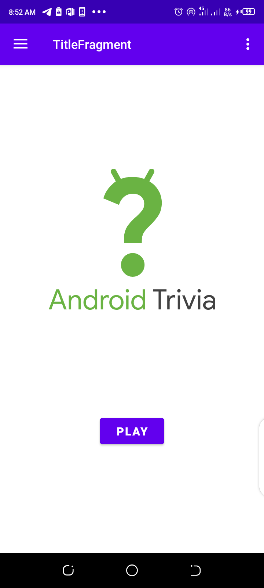
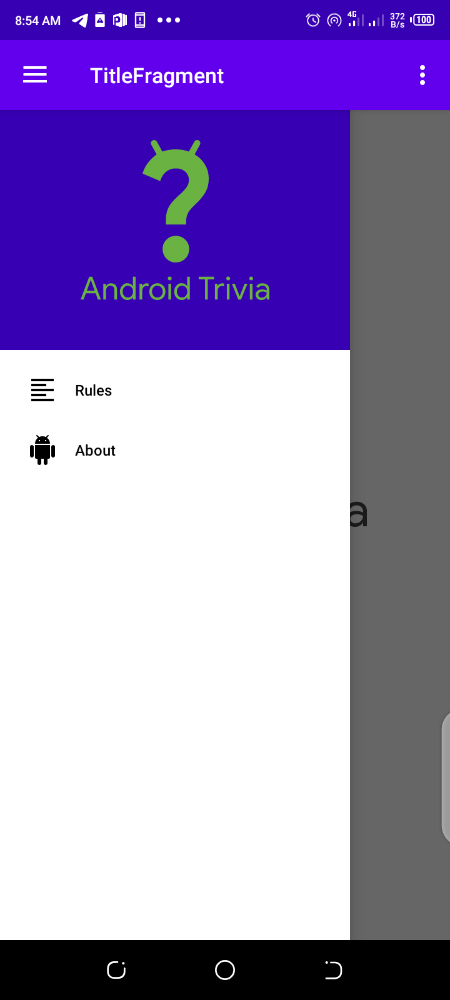
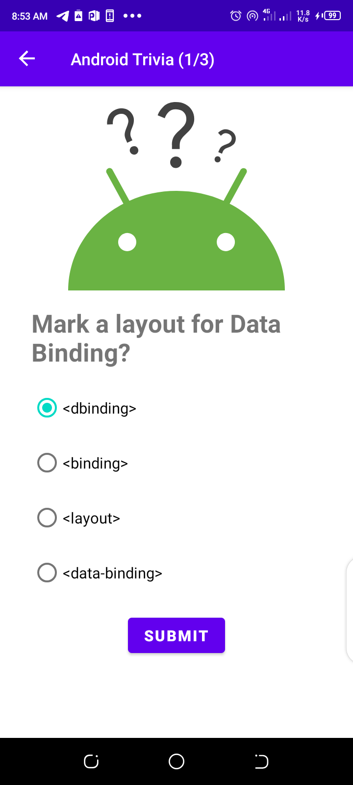
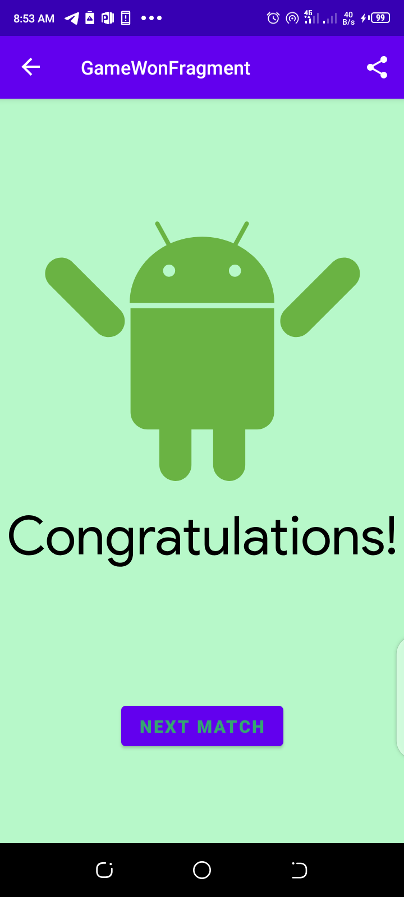
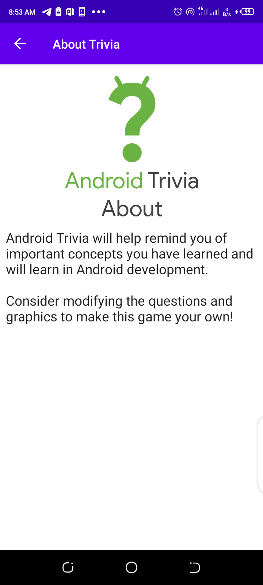
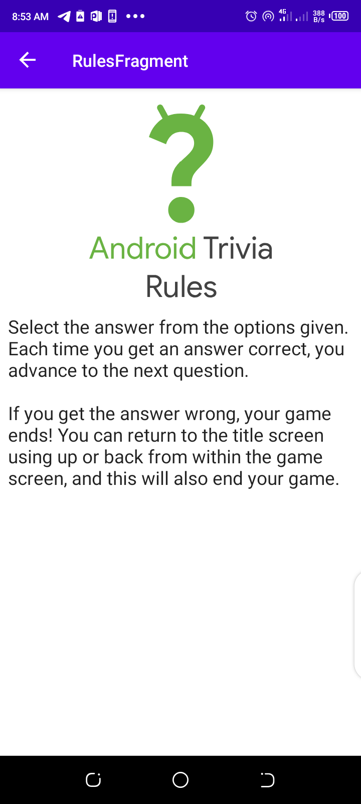

## Android Trivia
A clone of the Android Trivia App based on Lesson 3: Navigation from [Developing Android Apps With Kotlin][1] on Udacity
### Assets
* [Fragments][2]
* [DataBindingUtil][3]
* [Navigation][4]

### Screenshots
|||||
|:--:|:--:|:--:|:--:|
|||
|:--:|:--:|:--:|

[1]: https://classroom.udacity.com/courses/ud9012
[2]: https://developer.android.com/guide/fragments
[3]: https://developer.android.com/guide/fragments
[4]: https://developer.android.com/guide/navigation
